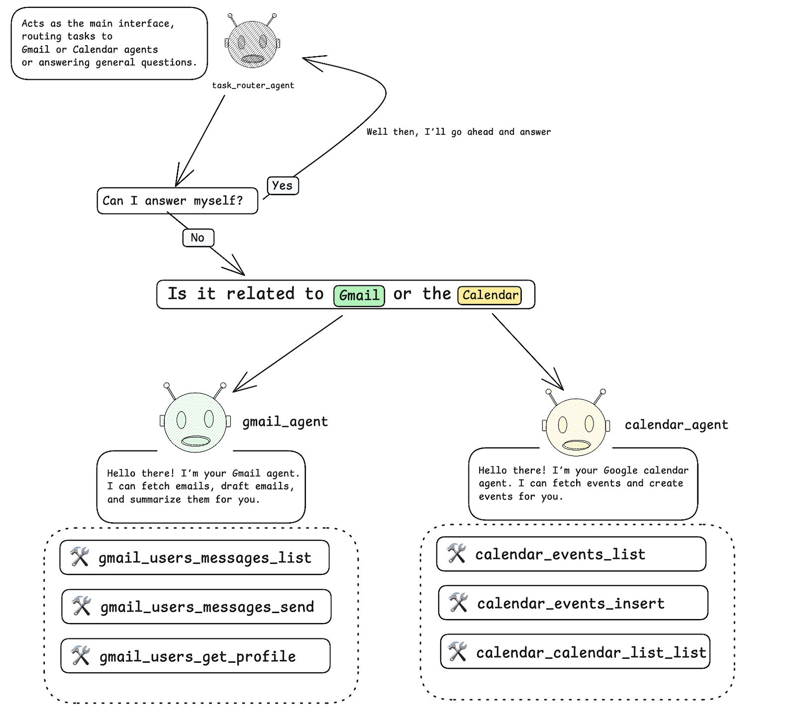

# Google Service Agent 

## Overview
Purpose of this project is to demonstrate how to build a service agent using the Google ADK framework. Especially focused on native Google products.

## Available Agents
- 📧 Gmail Agent: Email management & automation
- 📅 Calendar Agent: Scheduling & event coordination

## Workflow
User asks a question -> Receved by root agent -> Forwarded to appropriate agent -> Agent processes the request -> Returns response to root agent -> User receives response.

However, gmail agent and calender agent need to be authorized by the user manually.

## Usage
First install the google adk framework:
```bash
pip install google-adk
```
Then you can run agent loop using `python app.py`. If you prefer to use web interface, you can run `adk web` and access the web interface. More info [here](service-agent/agents/README.md)

## Overview
