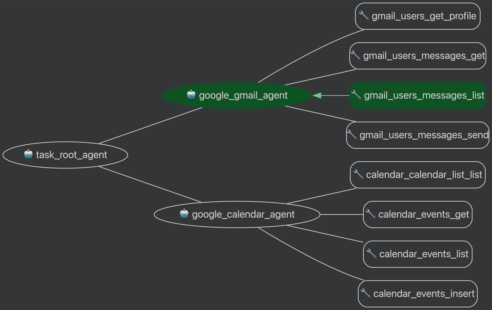

# Service Agent Platform

## Overview
An agent based system that demonstrates how to build a service agent using the Google ADK framework.:
- 📧 Gmail Agent: Email management & automation
- 📅 Calendar Agent: Scheduling & event coordination


## Requirements
- Google ADK framework
- Google Cloud Project credentials

## Installation
```bash
pip install google-adk
```

## Usage
```bash
adk web
```

## Overview
